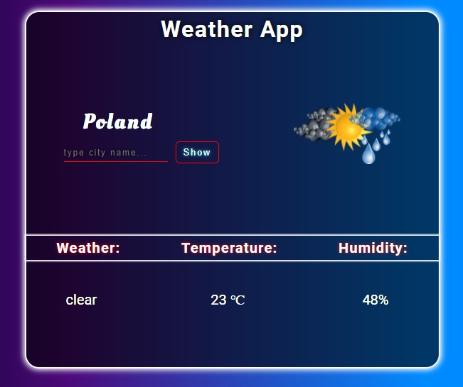

# WeatherApp

## Demo

[**click live demo of the project**](https://dominiksiejka.github.io/BillSplitterApp)



## Table of Contents

- [About the Project](#description)
- [How to use](#how-to-use)
- [Technologies used](#built-with)
- [Setup steps](#setup)
- [Sources](#sources)
- [License](#license)

## Description

WeatherApp shows you the current weather in choosen city. It also matches the particular image according to the weather. It uses 'openweather' API to fetch the weather data.

## How to use

Just insert the city name for which you would like to get the weather data. Then the three parameters of the weather will be shown. Also according to weather there will be different images served.

## Built with

- HTML5
- CSS
- Vanilla JavaScript

## Setup

```
with BASH

# clone the remote repo to your local one
$ git clone https://github.com/dominiksiejka/BillSplitterApp.git

# open the index.html file or use your code editor to open it with live server

```

## Sources

- Icons from [Font Awesome ](https://fontawesome.com)
- Font from [Google Fonts ](https://fonts.google.com/)

## License

- MIT © [Dominik Siejka ](https://github.com/dominiksiejka/BillSplitterApp)
